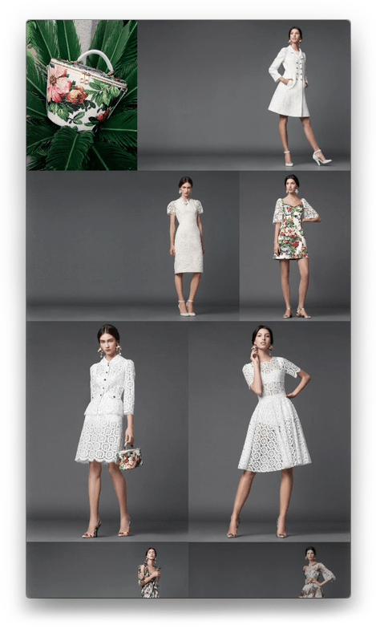

# Cascade v2.0

Cascade subclasses UIView, it can display portrait and landscape images on the same row. 

  - Reusable code
  - Easy to add code to supply images, from assets, or web API
  - Landscape and portrait orientation
  - Responsive design

### Display

### Gestures
Cascade has the following gestures
* Refresh gesture pulldown. for refreshing with new content.
* Pinch-in gesture, reduces number of images on each row
* Pinch-out gesture, increases number of images on each row

### New Features coming soon..

  - Support for httpRequest coming soon
  - add images 
  - full screen image view with swiping

### Installation

* download the zip file.
* unzip
* open Cascade2.xcodeproj

### Change Log
* v2.0 first commit
